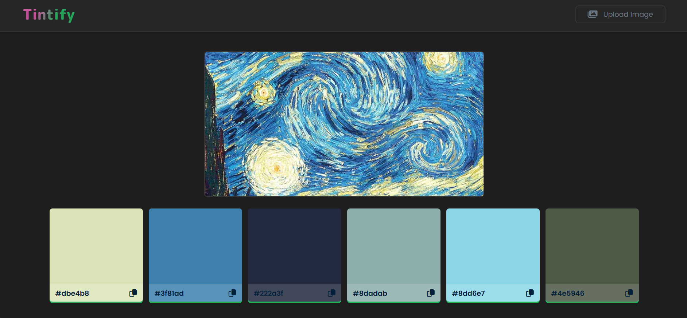

# 🎨 Tintify

**Tintify** is a simple and elegant color palette generator that extracts dominant colors from any uploaded image using JavaScript and the Color Thief library. It's built with Next.js and provides an interactive and visually appealing UI.

🔗 [Live Site](https://tintify.vercel.app/)  
📦 [GitHub Repository](https://github.com/VaidehiS74/Tintify)

---

## 🚀 Features

- 🌈 Extracts a **color palette of 6 dominant colors** from any image
- 🖼 Upload your own images
- 🔍 View RGB and HEX values for each color
- 📋 One-click **copy to clipboard** for HEX codes
- 💡 Smooth user feedback with "Copied!" toast
- ⚡ Fast, responsive, and easy to use interface

---

## 📸 Preview

 

---

## 🛠️ Tech Stack

- **Framework**: [Next.js](https://nextjs.org/)
- **Color Extraction**: [Color Thief](https://www.npmjs.com/package/colorthief)
- **Styling**: CSS Modules
- **Hosting**: [Vercel](https://vercel.com/)

---

## 📁 Folder Structure

```
palette-gen-main/
├── components/
│   ├── DisplayImage.js
│   └── ListItem.js
├── public/
│   └── favicon.ico
├── styles/
│   └── Home.module.css
├── pages/
│   ├── _app.js
│   └── index.js
├── package.json
└── README.md
```

---

## 📦 Installation

```bash
git clone https://github.com/VaidehiS74/Tintify.git
cd Tintify
npm install
npm run dev
```
---

-Made with ❤️ by Vaidehi Singh

